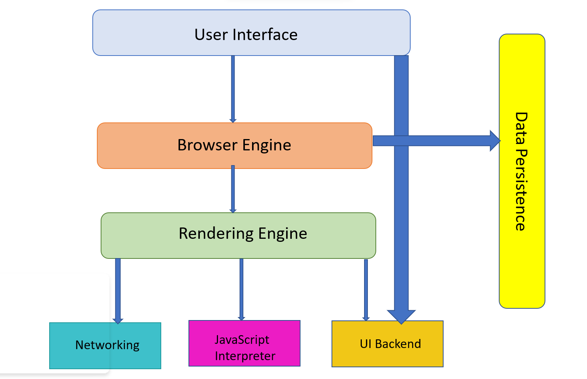
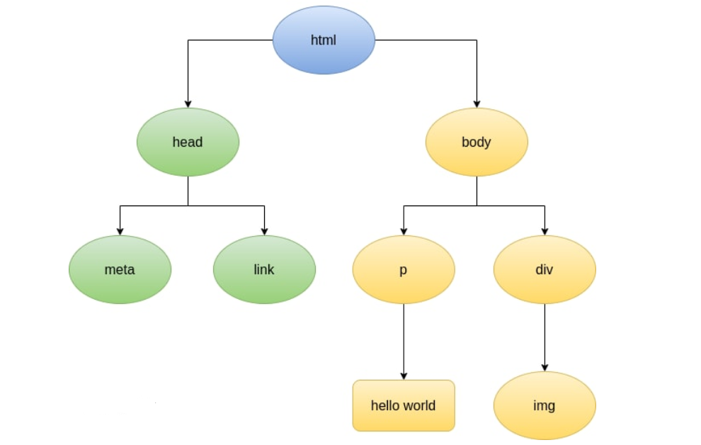
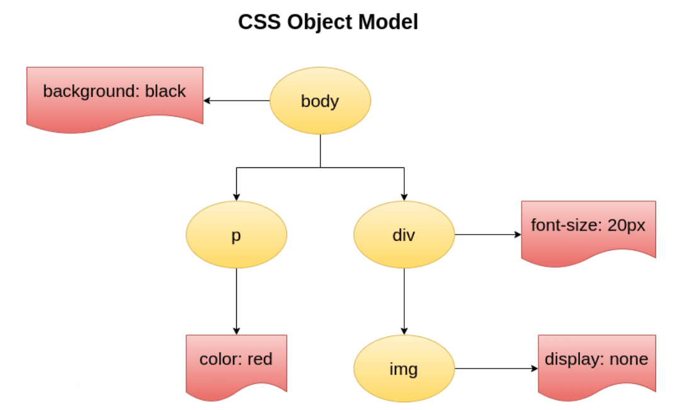
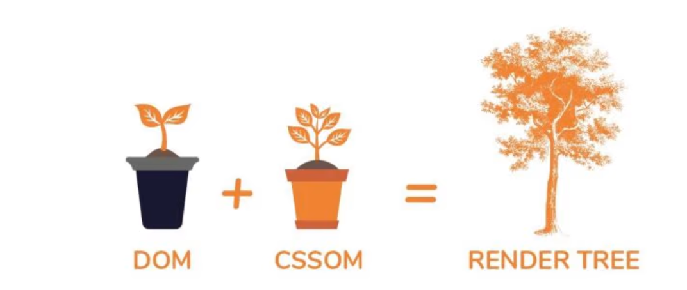

## **The Browser’s Main Functionality**

A browser (also known as a browser) is a software application that allows us to access information on the World Wide Web, it present us with web resource , by requesting it from the server and displaying it in the browser window. The resource is usually an HTML document, but can also be a PDF, image, or some other type of content. The location of the resource is specified by the user using a URI (Uniform Resource Identifier).The main function of the browser is to locate, retrieve and display the required information.

## ****The Browser's high level structure****

A web browser consists of various structured bundles of code that are required to perform certain tasks to retrieve HTML, CSS and javaScript of a web page to the end-user. Based on their task these bundles of structured code are divided as follows .

1. **The user interface**: this includes the address bar, back/forward button, bookmarking menu, etc. Every part of the browser display except the window where you see the requested page.
2. **The browser engine**: The browser engine behaves like a bridge between the user interface and the rendering engine.
3. **The rendering engine** : Responsible for displaying requested content. For example if the requested content is HTML, the rendering engine parses HTML and CSS, and displays the parsed content on the screen.
4. **Networking**: Handles network calls such as HTTP requests, using different implementations for different platform behind a platform-independent interface.
5. **UI backend**: used for drawing basic widgets like combo boxes and windows. This backend exposes a generic interface that is not platform specific. Underneath it uses operating system user interface methods.
6. **JavaScript interpreter**. Used to parse and execute JavaScript code.
7. **Data storage**. This is a persistence layer. The browser may need to save all sorts of data locally, such as cookies. Browsers also support storage mechanisms such as localStorage, WebSQL and FileSystem.

## Events Browser get Involved When the URL is Entered in it.

### 1.look up for the location of the server hosting the website.

After the URL is typed into browser and pressed entered , the browser needs to figure out 

which server on the Internet to connect to, it contact the internet service provider (ISP), which in turn checks in DNS and get the IP address of the Domain requested . DNS data is cached at different layers between your browser and at various places across the Internet. through these caches the IP address of the Domain server can be  figured out in less time.

Once the browser gets the DNS record with the IP address, it’s time for it to find the server on the Internet and establish a connection.

### 2.**Browser initiates TCP connection with the server**

Using the public Internet routing infrastructure, Browser sends request to server and establish the TCP connection with the server .

Once the browser has established a connection with the server, the next step is to send the HTTP request to get the resource, or the page.

### 3.**Browser sends the HTTP request to the server**

Now that the browser has a connection to the server, it follows the rules of communication for the HTTP(s) protocol. Browser sends an HTTP request to the server to request the contents of the page, request can also include  any one of GET, POST, PUT, PATCH, DELETE, or a handful of other HTTP verbs.

Once the server has received the request from the client, the server processes it and sends back a response.

### 4.**Server processes request and sends back a response.**

The server takes the request and based on the info in the received message , it gets the content from the requested path constructs the response and sends it back to the client. 

### 5.**Browser renders the content.**

Browser Perform the series of steps  to convert HTML, CSS, and JavaScript into a working website and render it on the screen .

## **Steps Involved in Web Page Rendering**

### 1.**Construction of DOM→ From raw bytes of HTML to DOM**

- Browser receives an HTML document from the server in the binary stream format, which is basically a text file .
- When the browser reads the HTML document, whenever it encounters an HTML element, it creates a JS object called a **Node**. Eventually, all html elements will be converted to a **Node**.
- After the browser has created nodes from the HTML document, it has to create a "tree-like" structure of these node objects , which is called as Document Object Model(DOM).,Below is the example of the simple DOM tree.

### 2.**Construction of CSSOM→ From raw bytes of CSS to CSSOM**

- After constructing the DOM, the browser reads CSS from all the sources & constructs a CSSOM (CSS Object Model) - a tree-like structure.
- Each node in this tree contains CSS-style information that will be copied to the DOM element it targets.
- Most of the browser comes with their own stylesheet which is called user-agent stylesheets. It is a default stylesheet used by web browsers. in the absence of any CSS applied, the browser still has to render the content somehow, and the browser uses the user-agent stylesheet for that.

### 3.Other Process→ O****rder of processing scripts and style sheets****

**JavaScript Compilation**

- The model of the web is synchronous.  scripts are expected to be  parsed and executed immediately when the parser reaches a script tag. The parsing of the document halts until the script has been executed.
- If the script is external then the resource must first be fetched from the network–this is also done synchronously, and parsing halts until the resource is fetched. This was the model upto HTML4 .
- HTML5 adds an option to mark the script as asynchronous so it will be parsed and executed by a different thread.

****Style sheets****

- Style sheets on the other hand have a different model. Conceptually it seems that since style sheets don't change the DOM tree, there is no reason to wait for them and stop the document parsing.
- There is an issue, if the scripts asks for style information during the document parsing stage, if the style is not loaded and  parsed yet , script will get wrong answers  and  causes the problems.
- All scripts temporarily need to blocked when  there is a style sheet that is still being loaded and parsed.

### 4.**Construction of Render Tree**

- DOM & CSSOM are combined together to form a Render tree that contains the nodes which have to be displayed on the page.
- From the root of the DOM tree, each **visible** node is traversed and a respective CSSOM rule is applied. Finally, it gives the render tree containing **visible** nodes with content and styling. Pictorial representation  would be as below .

### 5.****Laying out the render tree****

- This phase can be said as a **geometry phase**, where  geometry of the nodes will be calculated.
- In the layout phase, the exact position of the nodes and their size respective to the view-port of the browser is computed. In this way, a **box model** is generated which knows the exact positions and size. This process is also known as **layout** .Box model is also generated in  Layout phase.

### 6.**Painting Phase**

- Visible nodes, their styling, & their geometry, now all this information is used to render the nodes from the render tree to actual pixels on the screen.
- This process is referred to as Painting. It uses the UI backend layer.

