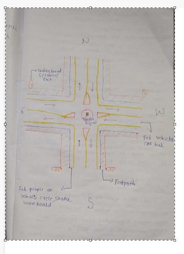
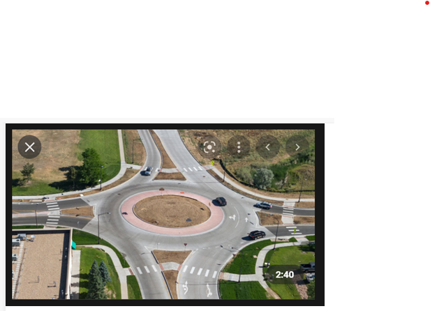

## Design Thinking

**Problem Statement:** Designing the Intersection at Chicago which is one of the busiest roads in the city.

**Design Steps:** 

- To begin to design the intersection kept all age group, all types of vehicles, different time window when roads will be busy/ moderate traffic are kept in mind and tried to provide the optimal solutions.
- The Time Frame is divided into 4 sets
    - 7AM~11AMàBusy Hours
    - 11AM~3PMàModerate Hours
    - 3PM~9PMàBusy Hours
    - 9PM~7AMàModerate Hours
- **Design:**
    - As it’s intersection, roads in + sign each side will have the 2-way roads built and the centre round circle consisting central traffic signals, and vehicles can circle around the centre to cross the signal and switch to other side of the road.
    - In Busy Hours section of the roads, will be preserved for public buses, School/College vehicles and Ambulances, and remaining part of the roads will be used for rest of the vehicles.
    - Traffic Signal Open green for every 6 mins in busy hours, and every 3 mins in moderate hours.
    - In Lane will have the separate road for Pedestrians and for the disabled people who will be on wheels, and separate roads for the people on wheels like Bicycles, Skates, Wave Boards etc.
    - For the Pedestrians, there is underground facility to cross to any side, and it has 4 entrance/exit available. To make the life of the aged and disabled people underground has the lift facility for the Hassel free commute.
- **Future Scope:**
    - For the heavy-duty vehicles carrying the goods, can be provided with flyover in future so that on ground traffic can be reduced at the junction to make the life of the office people, school students, easier without having to wait for long time un the traffic.
- **Design Model:**

- **Inspiration Model:**

